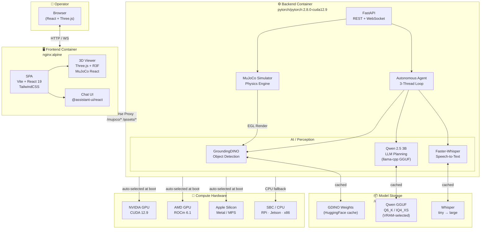

# Hexy — System Architecture

Hexy is a real-time autonomous cave search-and-rescue hexapod simulation platform. It combines physics-based locomotion (MuJoCo), multimodal AI perception (GroundingDINO + Whisper), and an LLM-driven autonomous agent (Qwen 2.5) in a single Dockerised stack. A React/Three.js frontend streams live simulation state and detection overlays to the operator.

---

## High-Level Architecture



---

## Hardware-Adaptive Inference Stack

Hexy's `entrypoint.sh` probes the host at container startup and selects the appropriate compute backend automatically — no manual config required.

| Target | Detection Method | PyTorch Backend | llama-cpp Backend |
|---|---|---|---|
| **NVIDIA GPU** | `nvidia-smi` · `/dev/nvidia0` · `NVIDIA_VISIBLE_DEVICES` | `cu121 / cu124` wheel | CUDA (`-DGGML_CUDA=on`) |
| **AMD GPU** | `/dev/kfd` · `/opt/rocm` | `rocm6.1` wheel | ROCm (`-DGGML_HIPBLAS=on`) |
| **Apple Silicon** | `uname -m == arm64` + Darwin | MPS (`torch.backends.mps`) | Metal (`-DGGML_METAL=on`) |
| **CPU / SBC** | fallback (RPi, Jetson, x86) | CPU wheel | CPU (`-DGGML_BLAS=on`) |

**VRAM-aware quantisation** — on GPU targets, the entrypoint measures free VRAM with `nvidia-smi` (or `rocm-smi`) and selects the best Qwen GGUF that fits:

| Free VRAM | Selected Model | Quality |
|---|---|---|
| ≥ 6 GB | `Qwen2.5-3B-Instruct-Q6_K.gguf` | High fidelity |
| ≥ 3 GB | `Qwen2.5-3B-Instruct-Q4_K_M.gguf` | Balanced |
| < 3 GB | `Qwen2.5-3B-Instruct-IQ4_XS.gguf` | Max stability |
| CPU / SBC | `Qwen2.5-3B-Instruct-IQ4_XS.gguf` | Minimum viable |

This means the exact same Docker image runs on a hackathon laptop, a workstation with an RX 7900 XTX, a Mac Studio M3 Ultra, or a Jetson Orin — with zero user intervention.

---

## Detailed Architecture

```mermaid
graph TD
    %% ── Browser ────────────────────────────────────────────────────────
    subgraph Browser["Browser"]
        direction TB
        WASDKeys["WASD Keys\n→ POST /mujoco/step"]
        ChatInput["Chat Input\n→ POST /agent/respond"]
        subgraph Hooks["React Hooks"]
            useMujoco["useMujocoStream\nWS /mujoco/stream 50ms"]
            useDino["useDinoDetections\nWS /mujoco/detections 200ms"]
            useWhisper["useWhisperStream\nWS /audio/whisper"]
        end
        subgraph Render3D["3D Scene"]
            SceneStage["SceneStage.tsx"]
            RobotScene["RobotScene.tsx\n(lazy, hexapod MJCF)"]
            PiP["PipCameraFrame.tsx\nDINO overlay + BBoxes"]
            SpatialAudio["SurvivorSpatialAudio.tsx\naudio direction indicator"]
            FloatingPanel["FloatingInfoPanel.tsx\ntelemetry"]
        end
        Zustand["Zustand Store\nuseRobotStatusStore"]
    end

    %% ── nginx ──────────────────────────────────────────────────────────
    subgraph Nginx["nginx (port 80→8080)"]
        StaticSPA["Serve SPA bundle"]
        Proxy["Proxy /mujoco/* /assets/*\n→ backend:8000"]
    end

    %% ── FastAPI ────────────────────────────────────────────────────────
    subgraph FastAPI["FastAPI  (port 8000)"]
        direction TB

        subgraph REST["REST Endpoints"]
            EP_step["POST /mujoco/step\n(WASD or ctrl[])"]
            EP_state["GET /mujoco/state"]
            EP_respond["POST /agent/respond\n(manual LLM call)"]
            EP_prompt["GET /agent/prompt"]
            EP_status["GET /agent/status\nGET /agent/autonomous/status"]
            EP_frame["GET /mujoco/detections/frame\n(debug PNG)"]
        end

        subgraph WS["WebSocket Endpoints"]
            WS_stream["WS /mujoco/stream\n→ joint + ctrl state JSON"]
            WS_detections["WS /mujoco/detections\n→ DINO bbox JSON"]
            WS_whisper["WS /audio/whisper\n→ transcript + direction JSON"]
        end

        RenderExec["_render_executor\nThreadPoolExecutor max_workers=1\n(single EGL thread)"]
        SimLock["_sim_lock\nthreading.Lock\n(serialises all mj_step calls)"]
    end

    %% ── MuJoCo Simulator ───────────────────────────────────────────────
    subgraph MuJoCo["MujocoSimulator"]
        direction TB
        Model["mj.MjModel\ncave_hexapod.xml\n↓ fallback hexapod_static.xml"]
        Data["mj.MjData\n(joint pos / vel / ctrl)"]
        IK["WASD IK Gait\n_build_wasd_control()\nphase = t × 4.8 Hz"]
        Renderer["mj.Renderer\nEGL headless\n640×360 RGB"]
        DriveKey["drive_key()\n_apply_base_key_velocity_locked()\n_stabilize_base_pose_locked()"]
    end

    %% ── Autonomous Agent ───────────────────────────────────────────────
    subgraph AutonomousAgent["AutonomousAgent (daemon threads)"]
        direction LR

        subgraph PhysicsThread["Thread: agent-physics"]
            PhysLoop["Continuous drive loop\nbatch = 52 ms / timestep steps\nget_nowait() → update current_key\ndrive_key() every batch"]
        end

        subgraph SensorThread["Thread: agent-sensor"]
            SensLoop["Poll every 2s\n→ render frame via render_fn\n→ dino.detect()\n→ latest_audio copy\n→ push context to prompt_queue"]
        end

        subgraph LLMThread["Thread: agent-llm"]
            LLMLoop["Block on prompt_queue\n→ build user_payload JSON\n→ qwen.infer()\n→ parse action JSON\n→ put_nowait to action_queue"]
        end

        ActionQueue["action_queue\nQueue(maxsize=2)\nLLM → physics"]
        PromptQueue["prompt_queue\nQueue(maxsize=8)\nsensors + operator → LLM"]

        SensLoop -->|"put_nowait"| PromptQueue
        PromptQueue -->|"get(timeout=1)"| LLMLoop
        LLMLoop -->|"put_nowait"| ActionQueue
        ActionQueue -->|"get_nowait"| PhysLoop
    end

    %% ── AI Services ────────────────────────────────────────────────────
    subgraph AIServices["AI / Perception Services"]
        direction TB

        subgraph DinoSvc["GroundingDinoService"]
            DinoModel["DINO model\nLeBabyOx/dino-cave-survivor\n(HF, loaded async)"]
            DinoDetect["detect(frame, config)\n→ [{label, confidence, bbox}]"]
            DinoConfig["build_config()\nprompt: 'person . survivor'\nbox_thresh=0.12"]
        end

        subgraph WhisperSvc["WhisperStream"]
            WhisperModel["faster-whisper\n(base, cuda/cpu)"]
            VAD["Voice Activity\nRMS threshold 0.03"]
            DirectionEst["Direction + Distance Est.\naudio_direction_estimate()"]
        end

        subgraph QwenSvc["Qwen25VlService"]
            QwenModel["llama-cpp Llama\nGGUF (Q6_K / IQ4_XS)\nn_ctx=4096\nn_gpu_layers=-1 (all)"]
            QwenInfer["create_chat_completion()\nllm.reset() before call\n(clears KV cache)"]
            JSONExtract["_extract_json()\n→ {action, reasoning}"]
        end
    end

    %% ── Model Storage ──────────────────────────────────────────────────
    subgraph Storage["/modelSetUp volume"]
        GW["/groundingDino/weights"]
        QW["/qwen25vl/*.gguf"]
        HFCache["~/.cache/huggingface"]
    end

    %% ── Hardware ───────────────────────────────────────────────────────
    subgraph HW["Compute  (auto-selected at boot)"]
        direction LR
        CUDA["NVIDIA CUDA 12.9\n(default)"]
        ROCm["AMD ROCm 6.1"]
        MPS["Apple MPS\n(Metal)"]
        CPU["CPU fallback\n(SBC / Jetson / x86)"]
    end

    %% ── Connections ────────────────────────────────────────────────────

    Browser --> Nginx
    Nginx --> Browser
    Nginx --> FastAPI
    FastAPI --> Nginx

    WASDKeys --> EP_step
    ChatInput --> EP_respond
    useMujoco <-->|"WS"| WS_stream
    useDino <-->|"WS"| WS_detections
    useWhisper <-->|"WS"| WS_whisper
    Hooks --> Zustand
    Zustand --> Render3D

    EP_step --> SimLock --> DriveKey
    WS_stream --> Data
    WS_detections --> RenderExec
    RenderExec --> Renderer

    Renderer --> DinoDetect
    Data --> IK --> DriveKey
    DriveKey --> Data

    AutonomousAgent -->|"render_fn\n→ _render_executor"| RenderExec
    SensLoop --> DinoSvc
    LLMLoop --> QwenSvc
    WS_whisper --> WhisperSvc
    WhisperSvc -->|"update_audio()"| AutonomousAgent

    PhysLoop --> SimLock

    QwenInfer --> JSONExtract
    DinoModel --> DinoDetect
    WhisperModel --> VAD --> DirectionEst

    DinoSvc <--> GW
    QwenSvc <--> QW
    WhisperSvc <--> HFCache
    DinoSvc <--> HFCache

    AIServices --> HW
    MuJoCo --> HW
```



---

## Service Topology

```
┌─────────────────────────────────────────────────────┐
│ docker-compose                                      │
│                                                     │
│  ┌──────────────┐  :8080   ┌──────────────────────┐ │
│  │   frontend   │◄────────►│       backend        │ │
│  │  nginx:alpine│  proxy   │ pytorch/pytorch:2.8.0│ │
│  │   SPA bundle │          │  FastAPI + uvicorn   │ │
│  └──────────────┘          │  MuJoCo 3.8          │ │
│                            │  GDINO + Whisper     │ │
│                            │  Qwen 2.5 (llama-cpp)│ │
│                            │  Autonomous Agent    │ │
│                            └──────────────────────┘ │
│                                      │               │
│                             ┌────────▼──────────┐   │
│                             │   /modelSetUp     │   │
│                             │   (bind volume)   │   │
│                             └───────────────────┘   │
│                                                     │
│  ┌──────────────┐  profile: training               │
│  │   learning   │  JAX/Brax hexapod RL             │
│  │  (cpu/cuda)  │  → ./learning/ volume            │
│  └──────────────┘                                   │
│                                                     │
│  ┌──────────────┐  profile: data-gen               │
│  │   cave-gen   │  procedural cave generation      │
│  └──────────────┘                                   │
└─────────────────────────────────────────────────────┘
```

---

## Autonomous Agent Thread Model

```
entrypoint.sh boot
      │
      ├─ detect hardware → install torch wheel
      ├─ measure VRAM   → select GGUF quantisation
      └─ exec uvicorn

FastAPI startup (warm_models)
      │
      ├─ Thread: GDINO load (HuggingFace async)
      ├─ Thread: Qwen load  (llama-cpp GGUF → GPU)
      │
      └─ AutonomousAgent.start()
            │
            ├── [agent-physics]  ─────────────────────────────────┐
            │     while running:                                   │
            │       get_nowait(action_queue) → update current_key  │
            │       if current_key:                                │
            │         with sim_lock:                               │
            │           drive_key(current_key, batch=52ms/dt)      │
            │       else: sleep(50ms)                              │
            │                                            ▲         │
            │                                   action_queue       │
            │                                   Queue(maxsize=2)   │
            │                                            │         │
            ├── [agent-llm]  ────────────────────────────┘         │
            │     while running:                                   │
            │       item = prompt_queue.get(timeout=1s)            │
            │       qwen.infer(system_prompt, user_payload_json)   │
            │         → parse {action, reasoning}                  │
            │         → put_nowait(action_queue)                   │
            │                                            ▲         │
            │                                   prompt_queue       │
            │                                   Queue(maxsize=8)   │
            │                                            │         │
            └── [agent-sensor]  ─────────────────────────┘
                  while running:
                    sleep(2s)
                    render frame → render_fn → _render_executor (EGL thread)
                    dino.detect(frame) → format detections
                    latest_audio → check staleness (10s TTL)
                    if any signal: put_nowait(prompt_queue)
```

---

## Key Design Decisions

| Decision | Rationale |
|---|---|
| Single `_render_executor` (max_workers=1) | EGL contexts are single-thread; all renders serialised to one thread eliminates `EGL_BAD_ACCESS` |
| `llm.reset()` before each inference | Clears llama-cpp KV cache; prevents `llama_decode returned -1` on context overflow |
| Continuous physics loop (52ms batches) | Gait cycle = 1/4.8 Hz ≈ 208ms; tiny `n_steps` from LLM caused tap-not-walk; continuous loop keeps the robot walking between inferences |
| `ThreadPoolExecutor` for agent render | Sensor loop routes renders through `render_fn` callback → same EGL thread as WebSocket renders |
| Lazy singleton services | GDINO and Qwen take 30–120s to load; lazy init lets the API serve other routes immediately |
| GGUF quantisation over HF safetensors | llama-cpp GGUF loads 4–6× faster, uses 2–4× less VRAM; no Python torch overhead per token |
| Qwen 2.5 3B not 7B | 6 GB VRAM budget leaves headroom for GDINO (≈1.2 GB) and MuJoCo EGL framebuffers |
