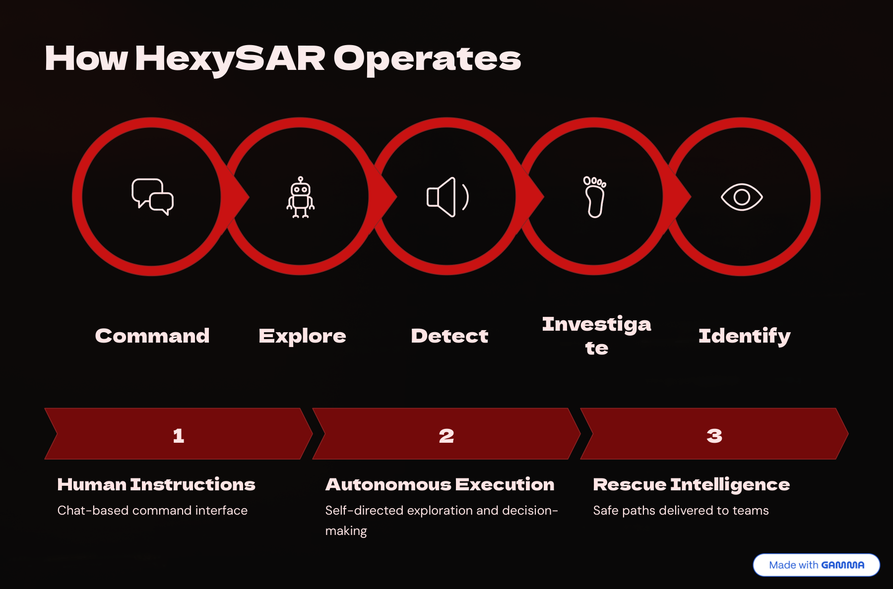
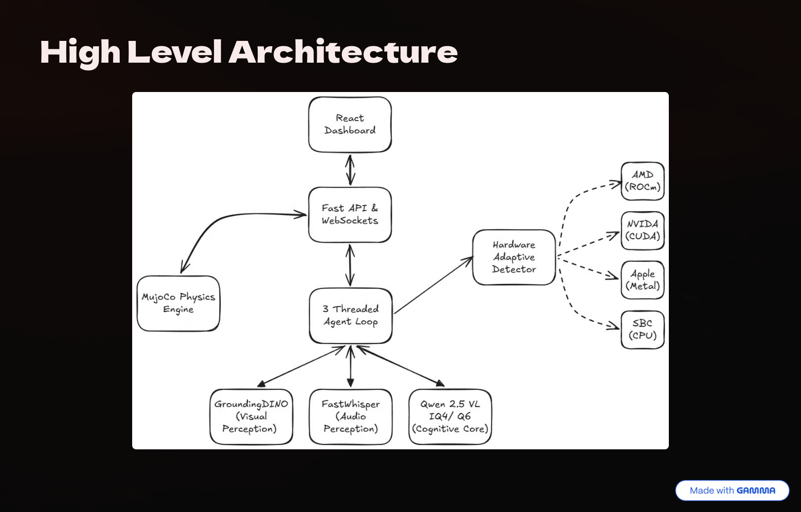
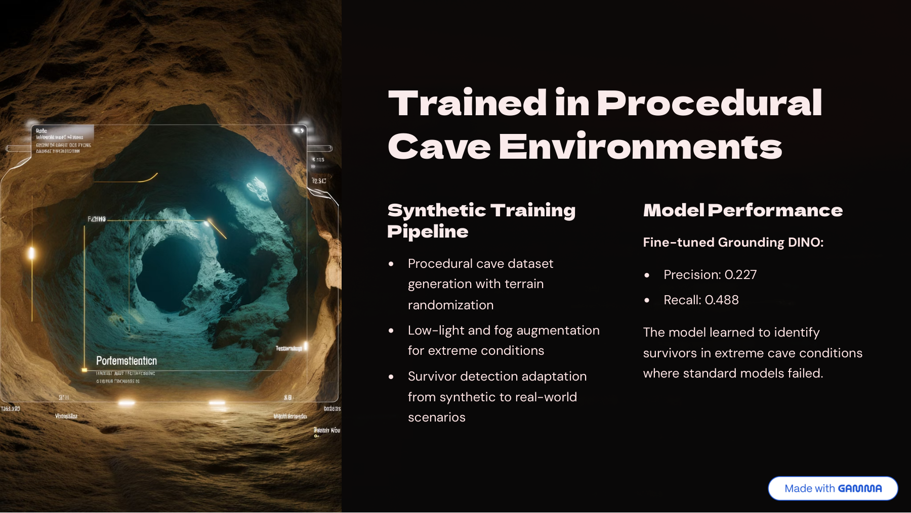
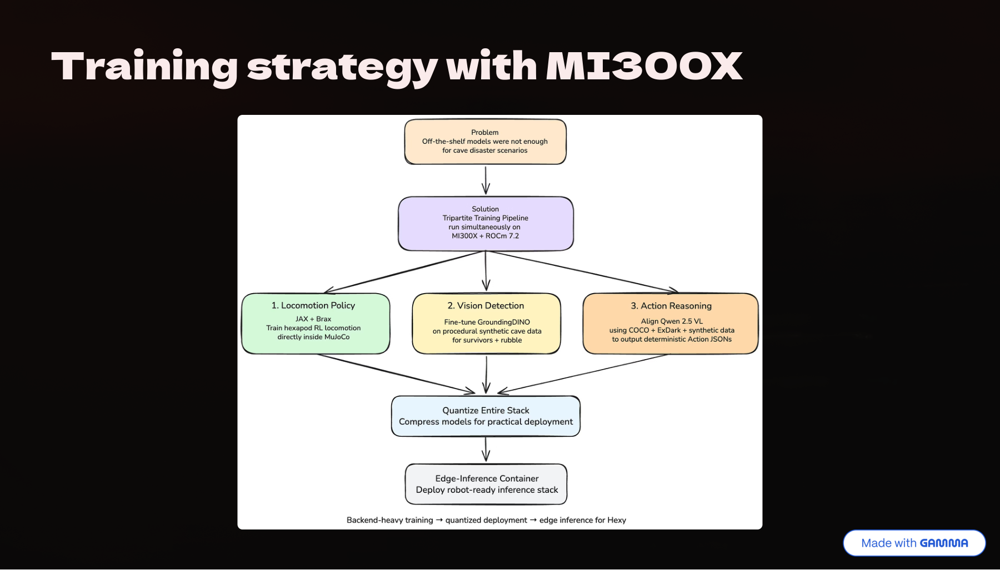
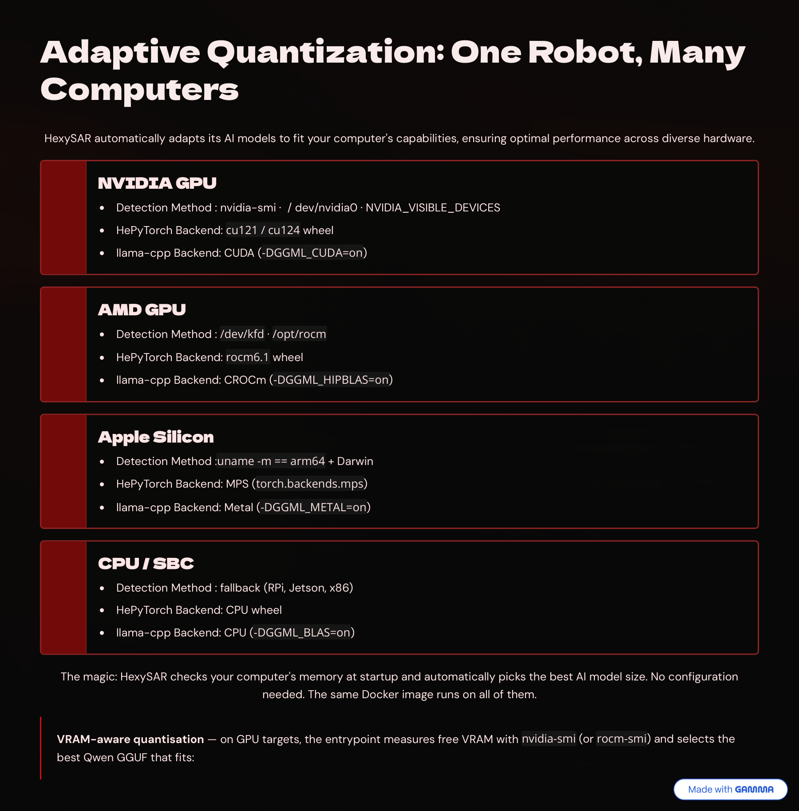
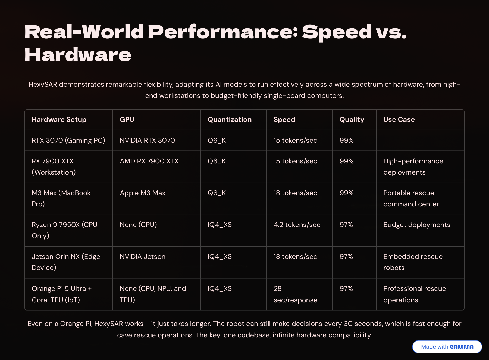

# HexySAR
> **Send the robot first. Reduce rescuer risk. Find survivors faster.**

HexySAR is an AI-powered hexapod robot system for cave search-and-rescue scenarios. It combines MuJoCo simulation, survivor detection, spatial audio, multimodal reasoning, and a web control interface so an operator can send high-level instructions while the robot explores hazardous cave terrain.

The project is built for local execution. The Hugging Face Space is a landing page only, not a hosted live demo, because the full system needs local model weights and several GB of RAM/VRAM for MuJoCo, Grounding DINO, Whisper, and Qwen inference.

<p align="center">
  <a href="https://drive.google.com/file/d/1gs_yOKZyv6_t3wxFjLplpX3eHqoROJ5X/view?usp=sharing"><strong>📺 Watch Video Presentation</strong></a> ·
  <a href="https://huggingface.co/LeBabyOx/dino-cave-survivor"><strong>🤗 DINO Model on HuggingFace</strong></a> ·
  <a href="https://huggingface.co/spaces/pBillyy/Hexy"><strong>🏠 Landing Page</strong></a>
</p>

---

## 🔗 Links

| Resource | Link |
|----------|------|
| 📺 Video Presentation | [Watch on Google Drive](https://drive.google.com/file/d/1gs_yOKZyv6_t3wxFjLplpX3eHqoROJ5X/view?usp=sharing) |
| 🏠 Landing Page | [Hugging Face Space](https://huggingface.co/spaces/pBillyy/Hexy) |
| 🤗 Fine-tuned DINO Model | [LeBabyOx/dino-cave-survivor](https://huggingface.co/LeBabyOx/dino-cave-survivor) |
| 📦 Model Weights Bundle | [Download from Google Drive](https://drive.google.com/file/d/1AOns_bZGLbrnlYZFbRv-Sieed4Aipxe6/view?usp=sharing) |
| 📊 Presentation Slides | [View PDF](https://storage.googleapis.com/lablab-static-eu/presentations/submissions/oq9dyyryejwqmb9ehco67emb/oq9dyyryejwqmb9ehco67emb-1778432969348_adsnxslx0ullw5jjrnl2ieqs.pdf) |

---

## 🎯 What It Does

HexySAR sends an autonomous robot into unsafe cave environments before human rescuers enter.

| Step | Behavior |
|------|----------|
| **Command** | Operator gives plain-English instructions such as "search the left corridor" |
| **Explore** | Robot navigates the cave simulation using hexapod locomotion |
| **Detect** | Vision AI identifies possible survivors and audio AI listens for distress calls |
| **Reason** | Qwen combines detections, audio context, and operator intent |
| **Report** | Robot returns status, survivor cues, and next actions through the control interface |



---

## 🏗️ System Architecture



| Layer | Role |
|-------|------|
| **Frontend** | React control center with chat, robot telemetry, camera views, and 3D simulation |
| **Backend** | FastAPI service coordinating MuJoCo, WebSockets, AI inference, and agent state |
| **AI Stack** | Grounding DINO for vision, faster-whisper for audio, Qwen 2.5-VL for reasoning |
| **Simulation** | MuJoCo hexapod with inverse kinematics, tripod gait, cameras, and cave assets |

The autonomous loop runs across three main threads:

| Thread | Role | Cycle |
|--------|------|-------|
| **Physics** | Executes queued locomotion commands through IK gait control | ~52 ms batches |
| **Sensors** | Polls survivor detections and cached spatial audio context | Every 2 s |
| **Brain** | Uses Qwen to choose structured navigation actions | ~3 s per decision |

---

## 🤖 AI Pipeline

### 👁️ Vision — Grounding DINO

- **Fine-tuned model**: [`LeBabyOx/dino-cave-survivor`](https://huggingface.co/LeBabyOx/dino-cave-survivor)
- **Training data**: Synthetic MuJoCo cave scenes with low-light, blur, noise, and fog augmentation
- **Detection prompts**: `person . human . survivor . human silhouette`
- **Performance**: Precision 0.227, Recall 0.488 on the cave-survivor task
- **Post-processing**: Area filters, aspect-ratio checks, color gating, luma analysis, and NMS

### 🎙️ Audio — Whisper Spatial STT

- **Model**: faster-whisper base (~0.15 GB VRAM)
- **Input**: Synthetic stereo distress calls with panning and distance attenuation
- **Keywords**: "help", "save me", "over here"
- **Output**: Transcript plus approximate direction and distance cues

### 🧠 Reasoning — Qwen 2.5-VL

- **Runtime**: llama-cpp-python with GGUF models (~1.7–2.5 GB VRAM)
- **Input**: JSON containing detections, audio context, and operator instructions
- **Output**: Structured movement commands such as `{"action": "w", "reasoning": "..."}`
- **Quantization**: Selects IQ4_XS, Q4_K_M, or Q6_K based on available memory

### 🦿 Locomotion

- Six-leg inverse kinematics controller
- Hand-crafted tripod gait with smoothstep swing and stance phases
- MuJoCo physics with heading stabilization and joint-limit enforcement
- Commands: forward, backward, turn left, turn right, stop

---

## 🏋️ Training & Data



HexySAR uses synthetic cave generation so perception and reasoning can be tested under low-light and noisy conditions.



| Pipeline | Framework | Purpose |
|----------|-----------|---------|
| **Locomotion** | MuJoCo + Brax/JAX | Train and test hexapod movement |
| **Vision** | Grounding DINO | Adapt survivor detection to cave-like scenes |
| **Reasoning** | Qwen 2.5-VL | Convert multimodal context into deterministic action JSON |

The dataset generation path is opt-in. The default Docker startup uses existing assets and does not regenerate the cave dataset.

---

## 🔧 Hardware & Adaptive Quantization

The full system is intended to run locally because inference and simulation are resource-heavy. HexySAR automatically adapts its AI models to fit your hardware — **no configuration needed**.

### Memory Budget

| Component | Approximate VRAM |
|-----------|-----------------|
| 👁️ Grounding DINO (Vision) | ~1.2 GB |
| 🎙️ faster-whisper (Audio) | ~0.15 GB |
| 🧠 Qwen 2.5 (Reasoning) | ~1.7–2.5 GB |
| **Full AI stack** | **~3–4 GB** + system RAM |

### Smart Startup

HexySAR detects your hardware at boot and selects the optimal model:

| VRAM Available | Quantization | Quality |
|---------------|--------------|---------|
| ≥ 6 GB | Q6_K | 99% |
| ≥ 3 GB | Q4_K_M | 98% |
| < 3 GB | IQ4_XS | 97% |
| CPU / SBC | IQ4_XS | 97% |



### Platform Detection

| Platform | Detection | Backend |
|----------|-----------|---------|
| **AMD GPU** | `/dev/kfd`, `/opt/rocm` | ROCm / HIPBLAS |
| **NVIDIA GPU** | `nvidia-smi`, `/dev/nvidia0` | CUDA |
| **Apple Silicon** | `arm64` on Darwin | MPS / Metal |
| **CPU / SBC** | fallback | CPU / BLAS |

### Real-World Performance



| Hardware | GPU | Quant | Speed | Quality |
|----------|-----|-------|-------|---------|
| RTX 3070 | NVIDIA | Q6_K | 15 tok/s | 99% |
| **RX 7900 XTX** | **AMD** | **Q6_K** | **15 tok/s** | **99%** |
| M3 Max | Apple | Q6_K | 18 tok/s | 99% |
| Ryzen 9 7950X | CPU only | IQ4_XS | 4.2 tok/s | 97% |
| Jetson Orin NX | NVIDIA | IQ4_XS | 18 tok/s | 97% |
| Orange Pi 5 Ultra | NPU+TPU | IQ4_XS | 28 s/resp | 97% |

> Even on an Orange Pi, HexySAR works — the robot can still make decisions every ~30 seconds, which is fast enough for cave rescue. **One codebase, infinite hardware compatibility.**

---

## 🚀 Quick Start

### Prerequisites

- Docker with Compose v2
- For GPU acceleration: NVIDIA Container Toolkit or AMD ROCm
- Model weights bundle from the [link above](#-links)

Before running, extract the model bundle into the repository root so these paths exist:

```text
modelSetUp/groundingDino/weights
modelSetUp/qwen25vl
```

### Run

```bash
docker compose up --build
```

Open the frontend at **http://localhost:8080**.  
The backend is available at `http://localhost:8000` for direct API checks.  
No `.env` file is required for the default local setup.

### Cave Scene

At startup, the backend checks for `cave-gen/cave_env/cave_hexapod.xml`:

| State | Result |
|-------|--------|
| File exists | Cave scene loads in the browser |
| File missing | Static hexapod scene loads instead |

To regenerate cave assets:

```bash
docker compose --profile data-gen run --rm cave-gen
docker compose restart backend
```

To generate the optional synthetic dataset:

```bash
CAVE_GENERATE_DATASET=1 docker compose --profile data-gen run --rm cave-gen
```

---

## 💻 Local Development

**Backend:**

```bash
cd backend
pip install -r requirements.txt
uvicorn app.main:app --reload
```

**Frontend:**

```bash
cd frontend
npm install
npm run dev
```

The Vite dev server proxies `/health`, `/mujoco`, and `/assets/*` to `localhost:8000`.

---

## 📁 Repository Structure

```text
.
├── frontend/      React + Vite control interface
├── backend/       FastAPI, MuJoCo runtime, AI services, and WebSockets
├── learning/      MuJoCo + Brax/JAX simulation scripts and robot model
├── cave-gen/      Procedural cave generator and synthetic dataset pipeline
└── modelSetUp/    Local model weights for DINO, Qwen, and Whisper
```

---

## 👥 Team SINGKONG

Built for the AMD Hackathon.  
HexySAR helps rescuers save lives without risking more lives.

---

## 📄 License

See [learning/LICENSE](learning/LICENSE) for the hexapod model license.
